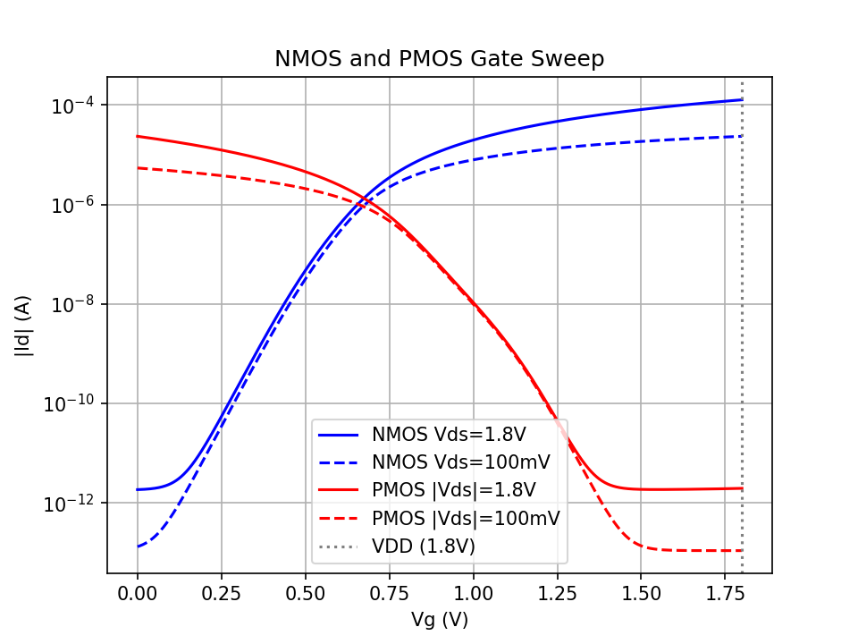
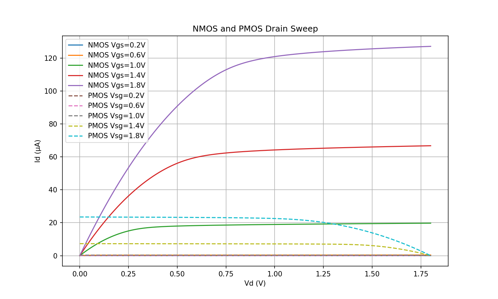

# spicesupport

SPICE simulation support for me to make gate and drain sweeps between my different PDKs.

## Overview

This repository contains device abstraction layers and characterization scripts for nmos/pmos devices.  The repo has examples for running ngspice simulations with the SkyWater 130nm PDK, but I also use HSPICE and commerical processes.

## Prerequisites

- [ngspice](http://ngspice.sourceforge.net/)
- Python 3 with numpy and matplotlib
- SkyWater 130nm PDK models

## Setup

Set the `SPICE_LIB` environment variable to point to your PDK models:
```bash
export SPICE_LIB=/path/to/skywater-pdk/libraries/sky130_fd_pr/latest/models
```

## Device Abstractions

The `sky130/devices.cir` file provides abstract device definitions that allow swapping between different PDKs without modifying your circuit files:

| Abstraction | SKY130 Device |
|-------------|---------------|
| `abnmos`    | sky130_fd_pr__nfet_01v8 |
| `abpmos`    | sky130_fd_pr__pfet_01v8 |

Usage in your SPICE netlist:
```spice
.include devices.cir
Xn1 drain gate source body abnmos
Xp1 drain gate source body abpmos
```

## Characterization Scripts

### Gate Sweep

Sweeps gate voltage from 0 to 1.8V for NMOS and PMOS at two drain voltages (saturation and linear regions).
```bash
ngspice -b gatesweep.cir
python plotgatesweep.py
```



### Drain Sweep

Sweeps drain voltage from 0 to 1.8V at multiple gate voltages for both NMOS and PMOS.
```bash
ngspice -b drainsweep.cir
python plotdrainsweep.py
```



## File Structure
```
spicesupport/
├── README.md
├── devices.cir          # Top-level abstraction (gitignored, copied from sky130/)
├── gatesweep.cir        # Gate sweep simulation
├── plotgatesweep.py     # Gate sweep plotting script
├── gatesweep.png        # Gate sweep output
├── drainsweep.cir       # Drain sweep simulation
├── plotdrainsweep.py    # Drain sweep plotting script
├── drainsweep.png       # Drain sweep output
└── sky130/
    └── devices.cir      # SKY130 device definitions
```

## Adding New PDKs

1. Create a new directory under `spicesupport/` (e.g., `gf180/`)
2. Add a `devices.cir` file mapping `abnmos` and `abpmos` to the appropriate devices
3. Copy the desired `devices.cir` to the top level before running simulations

## License

MIT